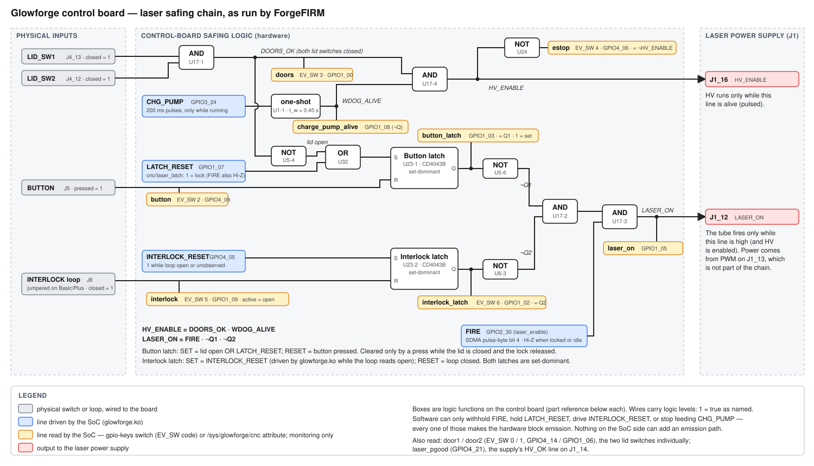

# Laser safety: how the machine is kept from firing

This document describes the laser-safing design of a stock Glowforge running
ForgeFIRM: the discrete hardware chain on the factory control board, what the
i.MX6 can see and drive, and the software layers ForgeFIRM stacks on top. The
hardware chain is the safety boundary; software only ever adds gates in front
of it and never bypasses it.

Signal names follow the factory board's nets. `GPIOx_yy` is the i.MX6 GPIO;
the Linux name in parentheses is how ForgeFIRM exposes it (device-tree
`gpio-keys` switch, or `glowforge.ko` `/sys/glowforge/cnc` attribute).

---

## 1. Principle

```
lid closed (both switches) ─┐
SoC alive (charge pump)   ──┴─▶ HV_ENABLE  ─────────────────▶ PSU: HV supply may run
                                                                       │
FIRE (per-tick stream bit) ─┐                                          ▼
button latch cleared      ──┼─▶ LASER_ON  ──▶ PSU: tube fires only when BOTH are true
interlock latch cleared   ──┘
```

Two independent hardware outputs go to the laser power supply on J1:

- **HV_ENABLE (J1_16)** — high only while the lid is closed *and* the SoC is
  actively retriggering a hardware one-shot ("charge pump"). A hung SoC, a
  stuck GPIO or an open lid drops it in hardware.
- **LASER_ON (J1_12)** — the SoC's per-tick FIRE request, AND-gated behind
  two hardware latches: the *button latch* (lid state + SoC lock, cleared only
  by a physical button press) and the *interlock latch* (set by the SoC,
  cleared only while the remote-interlock loop is closed — see §5 for what
  that means in ForgeFIRM today).

The SoC cannot fire the tube by driving one pin. It has to keep the one-shot
alive, release its own lock, wait for a human to press the button while the
lid is closed, and then stream FIRE bits — and any of those conditions going
away kills emission in hardware, not in software.

---

## 2. The hardware chain

### 2.1 Parts on the control board

| Ref | Part | Role |
|---|---|---|
| U1 | SN74AHC123A dual retriggerable monostable, R ≈ 499 kΩ / C ≈ 1 µF (t_w = 454 ± 3 ms, measured pulse-to-drop) | Charge-pump watchdog: Q stays high only while CHG_PUMP keeps arriving; times out 0.45 s after the last pulse |
| U5, U6 | SN74AHC14 hex Schmitt-trigger inverters | Level inversion / conditioning for every switch line and SoC readback |
| U17 | SN74AHC08 quad 2-input AND | The four gates: DOORS, HV_ENABLE, and the two-stage LASER_ON gate |
| U23 | CD4043B quad R/S latch (NOR type, active-high S/R, output enable tied high) | Latch 1 = button latch, latch 2 = interlock latch |
| U32 | 74AHC1G32 single 2-input OR | Lid-open OR SoC lock → button latch SET |
| U24 | 74AHC1G04 single inverter | HV_ENABLE readback to the SoC (the pin carries ¬HV_ENABLE; the factory design labels this net **E-STOP**) |
| U18 | i.MX6 Solo | The SoC: drives CHG_PUMP, LATCH_RESET, INTERLOCK_RESET, FIRE; reads everything else |

### 2.2 Inputs

| Net | Source | Conditioning | SoC pin | Linux exposure | Meaning |
|---|---|---|---|---|---|
| DOOR_SW1 (L) | J4_13, lid switch pulled to 3.3 V when closed | U5-1 inverts | GPIO4_14 (ball T6) | `gpio-keys` code 0 `door1`, active low → **active = closed** | Left lid switch |
| DOOR_SW2 (R) | J4_12 | U5-2 inverts | GPIO1_06 (T3) | code 1 `door2`, active low → **active = closed** | Right lid switch |
| DOORS | U17-1 = DOOR_SW1 · DOOR_SW2 | U5-3 inverts | GPIO1_00 (T5) | code 3 `doors`, active low → **active = both closed** | The lid term the chain actually uses |
| BUTTON | J5_5, 12 V through the button, 27 kΩ / 8.7 kΩ divider (≈ 2.9 V when pressed) | U5-5 inverts | GPIO4_09 (U6) | code 2 `button`, active low → **active = pressed** | Big front button. Also the RESET input of the button latch |
| INTERLOCK_SW | J8, 12 V through the remote-interlock loop, 432 Ω / 165 Ω divider (≈ 3.3 V when the loop is closed); factory-jumpered on Basic/Plus, brought out on Pro | U6-2 inverts | GPIO1_09 (T2) | code 5 `interlock`, active high → **active = loop OPEN** | Also the RESET input of the interlock latch |
| CHG_PUMP watchdog Q | U1-1 Q (pin 13): /A = GND, /CLR = 3.3 V, B = CHG_PUMP; each rising edge retriggers | U6-6 inverts | GPIO1_08 (R5) | `cnc/charge_pump_alive` (logical), `interlock_circuit` bit 5 (raw, 0 = alive) | watchdog alive |
| Button latch state | U23-1 Q → U5-6 → U6-1 | double inversion | GPIO1_03 (R7) | `cnc/button_latch`, `interlock_circuit` bit 2 | 1 = latch SET (fire blocked / not armed), 0 = armed |
| Interlock latch state | U23-2 Q → U6-3 → U6-4 | double inversion | GPIO1_02 (T1) | code 6 `interlock_latch`, active high → **active = latch SET** | 1 = interlock latch blocking |
| LASER_ON readback | J1_12 net (U17-3 output) | U6-5 inverts | GPIO1_05 (R4) | `cnc/laser_on`, `laser_on_sampled`, `interlock_circuit` bit 0 (raw, active low) | The gated output — the only software-visible proof of emission permission |
| HV_ENABLE readback (factory net name E-STOP) | U24 = ¬HV_ENABLE | — | GPIO4_06 (W5) | code 4 `hv_enable`, active low → **active = HV_ENABLE asserted** | Readback of the chain's own output, **not** an input: inactive at idle, active only while a run feeds the watchdog with the lid closed |
| LASER_PGOOD | J1_14 (the supply's HV_OK line) | — | GPIO4_21 (P24) | `cnc/laser_pgood`, `laser_pgood_sampled` (active low) | Read as "power good" from the laser supply; what the supply actually signals on it is not fully characterized |

### 2.3 SoC outputs into the chain

| Net | SoC pin | Driven by | Effect |
|---|---|---|---|
| CHG_PUMP | GPIO3_24 (F22, `charge-pump-gpio`) | `glowforge.ko`: one 0→1→0 pulse at run start, then every 200 ms from a soft hrtimer **only while `state == running`**; forced low on stop, disable, unload and kernel panic | Retriggers U1-1 (t_w = 454 ms, so a 200 ms feed holds Q solidly high and one missed pulse is tolerated). No edges → Q falls 0.45 s after the last pulse → HV_ENABLE drops with it |
| LATCH_RESET | GPIO1_07 (R3, `latch-reset-gpio`, init HIGH) | `cnc/laser_latch` (1 = lock). Also drives the FIRE line to high impedance while locked | Into U32 with lid-open; SETs the button latch → LASER_ON blocked until the next button press |
| INTERLOCK_RESET | GPIO4_05 (P5, `interlock-latch-reset-gpio`, init HIGH) | `glowforge.ko`: high whenever the remote-interlock loop reads open, or until a switch device reporting the loop has attached; low only while an attached device reports it closed (in-kernel input handler on the gpio-keys switch, EV_SW code 5). Read back as `interlock_latch_reset` / `interlock_circuit` bit 4 | SET input of the interlock latch → LASER_ON blocked in hardware while the loop is open |
| FIRE (LASER_ENABLE) | GPIO2_30 (E22, `laser-enable-gpio`) | The SDMA script, from bit 4 of each pulse byte; Hi-Z whenever the latch is locked or no run is in flight | One input of the final LASER_ON AND gate |

Laser *power* (PWM2 on J1_13) is not part of the chain: it sets the tube
current setpoint and is not gated. Emission permission is FIRE ∧ chain; the
laser-off guarantee rests on FIRE, and the kernel drops FIRE within one tick
on end-of-data or underrun.

### 2.4 Logic

```
DOORS_OK      = DOOR_SW1 · DOOR_SW2                              (U17-1)
WDOG_ALIVE    = U1-1 Q, retriggered by every CHG_PUMP rising edge
HV_ENABLE     = DOORS_OK · WDOG_ALIVE                            (U17-4)  → J1_16
                ¬HV_ENABLE                                        (U24 inverter) → GPIO4_06, read back as `hv_enable`

Button latch (U23-1):
  SET   = ¬DOORS_OK + LATCH_RESET                                 (U32 OR)
  RESET = BUTTON pressed
  Q1    = 1 → fire blocked; 0 → armed

Interlock latch (U23-2):
  SET   = INTERLOCK_RESET (SoC: high while the loop reads open or is unobservable)
  RESET = interlock loop closed
  Q2    = 1 → fire blocked

LASER_ON      = FIRE · ¬Q1 · ¬Q2                                 (U17-2, U17-3) → J1_12
```

The CD4043B is set-dominant: while SET is high the latch cannot be cleared.
That ordering is what makes the button meaningful — a press only arms the
machine when the lid is closed *and* the SoC has already released its lock.



### 2.5 What each condition does, in hardware alone

| Event | HV_ENABLE | LASER_ON | Recovery |
|---|---|---|---|
| Lid opens (either switch) | drops (DOORS_OK low) | drops immediately: ¬DOORS_OK SETs the button latch | close the lid, SoC lock released, **press the button** |
| SoC asserts LATCH_RESET (kernel `laser_latch=1`) | unchanged | blocked: button latch SET; FIRE line is also Hi-Z | `laser_latch=0`, then a button press |
| SoC stops toggling CHG_PUMP (hang, panic, stop, fault, underrun) | drops within one one-shot period | FIRE is parked by the same paths | next run restarts the feed |
| Button pressed with lid closed and lock released | — | armed (Q1 cleared) | — |
| Button pressed while lid open or lock held | — | stays blocked (SET is dominant) | — |
| Remote-interlock loop opens (Pro) | unchanged | blocked: the kernel drives INTERLOCK_RESET high on the switch edge, setting the interlock latch. Opening the loop by itself only releases the latch's RESET — the board has no direct trip path — so this SoC drive is what makes the interlock a hardware cut (see §3.1); software additionally cancels (or, with `lid_policy = hold`, parks) the job on `interlock` | close the loop: the kernel releases INTERLOCK_RESET and the closed loop resets the latch |
| Interlock latch already SET | unchanged | blocked | closing the loop clears it |

`hv_enable` (GPIO4_06) is a readback of this chain's own output, not an
input: it is inactive on an idle machine and active for the duration of any
kernel run — the window in which the charge pump is fed and HV_ENABLE is
alive. Nothing in ForgeFIRM gates on it; it is telemetry. (The factory design
labels the net E-STOP; no Glowforge model has an e-stop input, and a
retrofitted one belongs in the lid-switch chain, where the hardware enforces
it.)

---

## 3. Software layers on top

Every layer below sits *in front of* the chain: it can only withhold FIRE, hold
the lock, or starve the charge pump. None can produce emission the hardware
would not allow.

### 3.1 `glowforge.ko` (kernel)

- **Laser latch** (`cnc/laser_latch`, write-only): 1 = lock. Locking drives
  LATCH_RESET high (button latch SETs) *and* puts the FIRE line in high
  impedance so the SDMA stream physically cannot raise it. **Locked by
  default; every close of `/dev/glowforge` relocks.** Unlocking never restores
  the FIRE drive while a run or ramp is in flight — only run start and the
  resume waypoint do, and only if the latch is unlocked at that moment.
- **Charge pump only while running.** The 200 ms retrigger starts with the
  run and the callback returns without rearming as soon as the state leaves
  `running` (stop, halt, fault, underrun). Stop/disable/unload pin sets force
  CHG_PUMP low. A paused job is one of those states, so the chain de-energizes
  itself behind a pause without anyone asking it to: measured at the pads,
  motion stops 317 ms after the pause command and HV_ENABLE drops with the
  watchdog 550 ms after it (the feed ends with the run, then t_w expires) — a
  pause shorter than about half a second never drops HV at all. On the resume
  the pump primes with the run and HV_ENABLE is back within ~3 ms, while motion
  only restarts at ~219 ms: the chain re-arms about 216 ms **before** the first
  step, so a resumed cut is never waiting on it.
- **FIRE backstop.** At end-of-data and on underrun the SDMA script drops FIRE
  and the step lines within one tick; the FIRE line is parked Hi-Z at every
  run end and only a latch unlock plus a new run restores it.
- **Interlock latch drive.** The board's interlock latch is reset by a closed
  loop but can only be *set* by the SoC's INTERLOCK_RESET line; an open loop
  alone does not trip it. The driver owns that line through an in-kernel
  input handler on the gpio-keys switch device: it is high (latch set,
  LASER_ON blocked) from probe until the switch device attaches, whenever the
  loop reads open, and again if the switch device goes away — an
  unobservable loop counts as open. Only an attached device reporting the
  loop closed releases it, and the set-dominant latch then clears through
  its own RESET. The policy is host-tested (`tests/interlock_test.c`).
- **Dead man's switch.** A feeder holds `/dev/glowforge` open with `flock
  LOCK_EX`; if that fd closes while a program runs, the driver performs an
  emergency stop, puts the head in its safe state and de-energizes the
  thermal-loop heat sources.
- **Panic handler.** On a kernel panic the driver stops the EPIT and drives
  the pins safe directly: FIRE Hi-Z, CHG_PUMP low, LATCH_RESET asserted,
  steppers de-energized — because SDMA and EPIT would otherwise keep playing
  the ring with no kernel alive.
- **Readbacks** (`interlock_circuit` bits 0–5, `laser_on[_sampled]`,
  `laser_pgood[_sampled]`, `button_latch`, `charge_pump_alive`,
  `interlock_latch_reset`) are
  monitoring only; the driver enforces nothing from them. Bits 1, 3 and 4 are
  driven outputs read back from the data register — bit 3 says what the
  driver *commanded*, `laser_on` says what the chain *did*.

### 3.2 grblHAL controller (`grblHAL-glowforge`)

- **Operator-armed window.** The first laser-on of a job runs the arm flow on
  the protocol thread: coolant fire verdict must be OK, a head must be present
  (lens, air assist and beam detector live on it and the chain has no head
  term), fans go to the run profile, the latch is unlocked, and the controller
  then waits for the physical button (`laser_button_timeout_s`, default 300 s;
  a timeout or soft reset relocks and aborts). The hardware button latch is
  what the press clears — the software wait exists so the job does not start
  streaming FIRE bits into a blocked gate.
- **Disarm.** After `laser_disarm_s` (default 60 s) of no laser use, or on
  program end/abort, the controller relocks the latch, turns the button LED
  off and stands the cooling profile down. A job paused on the button is no
  laser use: the grace counts down through the hold and closes the window
  under a job left standing, so a long pause ends with the machine disarmed
  and the next emission needs a fresh press. The relock waits for the kernel to
  finish the queue tail so a controlled stop can never leave FIRE driven.
- **Coolant fire gates.** The armed window requires a fresh `fire_ok` verdict
  from the cooling engine (flow verification, over-temperature, lid-IR
  emission witness); a stale or failed verdict relocks in-process.
- **Safety door.** `doors` (lid) and `interlock` (loop open) are the core's
  safety-door signal, shown to the core only while it is in a job-time state
  (cycle, hold, tool change, door): a running job parks with a planned
  deceleration and — with `lid_policy = cancel`, the default and the factory
  firmware's behavior — is then cancelled: the armed window closes, a soft
  reset ends the sender's stream (from a fully parked state, so the position
  is kept and no alarm is raised), and the head returns to where the job
  started with the latch locked, lid open or not. The next job re-arms with a
  fresh button press, which is also what clears the hardware button latch
  the lid set — the software armed window and the hardware latch cannot
  disagree. `lid_policy = hold` keeps the stock door hold (once the door/loop
  closes the controller reports `Door:0` and a cycle start resumes it). During
  the arm wait either opening cancels the job outright under both policies.
  While idle, jogging or homing — and during the return-to-start motion after
  a cancel — the signal is hidden: the lid is opened at idle every time
  material is loaded and a door seen there would strand the controller in
  Door; it is delivered the moment the core leaves those states, so a job
  started with the lid open parks (and cancels) on its first poll. This is a
  motion/UX gate; the lid is *also* cut in hardware by the button latch, and
  the interlock by the interlock latch (§3.1).
- **Button.** Outside the arm wait the button is the job pause/resume toggle
  in both controller modes (feed hold / cycle start in GRBL mode; the
  factory's stop-backtrack-hold and lead-in resume in cloud mode); a held
  button has no further meaning during a job. A pause is deliberately **not** a
  cancel: the latch stays unlocked and the armed window open, which is what
  lets the next press resume the job. Emission still ends with the pause — the
  stream stops driving FIRE and the chain drops HV_ENABLE by itself (§3.1) —
  and the window closes on its own if the pause outlives the disarm grace. A
  lid or interlock open while paused takes the cancel path, so nothing resumes
  past an enclosure opening.
- **Head/motion witnesses.** Position counters are not proof of motion (the
  step-stream drives are open loop); the head accelerometer is the motion
  witness, and `beam_detect_analog` on the head is the live emission witness.

### 3.3 forgectrl (machine services)

- Holds `/dev/glowforge` for its lifetime (pulse-device broker) so controller
  handovers never close the device, and **relocks the latch (`cnc/stop` +
  `cnc/laser_latch=1`) on every transition out of a running child** —
  unexpected death, mode switch, restart.
- The **cooling engine** is the sole owner of the thermal hardware and
  publishes the fire verdict the controllers enforce; on a FIRE-class verdict
  it writes `cnc/stop` + `cnc/laser_latch=1` itself.
- The **motion-liveness gate** refuses to hand a controller a machine whose
  drivers may have wedged (counters running, motors dead) — a laser-safety
  corollary of "counters are not motion".
- `/status` reports the switch map and `laser_locked` (`interlock_circuit`
  bit 3) for the panel and telemetry; nothing in forgectrl reads the Grbl
  socket for machine state.

### 3.4 Cloud mode

The factory-experience client runs behind the same kernel latch, charge-pump,
backstop and dead-man rules; the precomputed pulse file it loads is subject to
the same FIRE gating as the live stream.

---

## 4. What is proven, and how

Verified on the bench with a probe on the PSU-connector LASER_ON pin and the
kernel readbacks (`CAMPAIGN-LOG.md` holds the drill records):

- Latch **locked**: 40,000 streamed FIRE bits → PSU pin flat, `laser_enable`
  0 — the lock severs the FIRE drive entirely.
- Latch **unlocked, chain unarmed** (no button press): `laser_enable` 1
  mid-window, PSU pin flat, `laser_on` 0 — the AND gate holds.
- FIRE drop at end-of-data and at true underrun: ≤ 1 tick, both termination
  paths.
- A latch unlock inside an acceleration ramp does not restore the FIRE drive
  for the in-flight run; a locked latch survives a stop + resume replay.
- Armed kill mid-FIRE: emission tail equals the ring in-flight only
  (15–171 ms), the latch relocks, the burn line ends abruptly.
- Switch bits 0–3, 5, 6 verified against physical state; bit 4
  (`hv_enable`) characterized live: inactive at idle, active through any run,
  and it flips together with `charge_pump_alive` on both edges (HV_ENABLE =
  DOORS_OK · WDOG_ALIVE observed).
- Interlock latch drive: with the connector unjumpered, `interlock`,
  `interlock_latch_reset` and `interlock_latch` all assert within one 50 ms
  sample and all clear when the loop is closed again.
- Watchdog period, measured directly from the SoC pins
  (`scripts/bench/cp_watchdog_timing.py`: every CHG_PUMP pulse latched by
  the GPIO edge detector, the ¬Q and ¬HV_ENABLE pads polled at ≈0.2 ms):
  Q falls **451.8 / 455.6 ms** after the last pulse (t_w = 454 ± 3 ms,
  matching R·C); Q rises on the priming pulse and HV_ENABLE falls with Q
  within one sample; the kernel feed period is 199.98 ms (199.87–200.07).
  A feed late by more than ≈254 ms therefore drops HV_ENABLE.

---

## 5. Not yet established

Present gaps in the hardware picture. None of them changes the safety
argument (every gap is on the readback/sense side or is a "which part"
question), but each is worth closing:

- **`laser_pgood` (HV_OK, J1_14) semantics** are not fully characterized.
